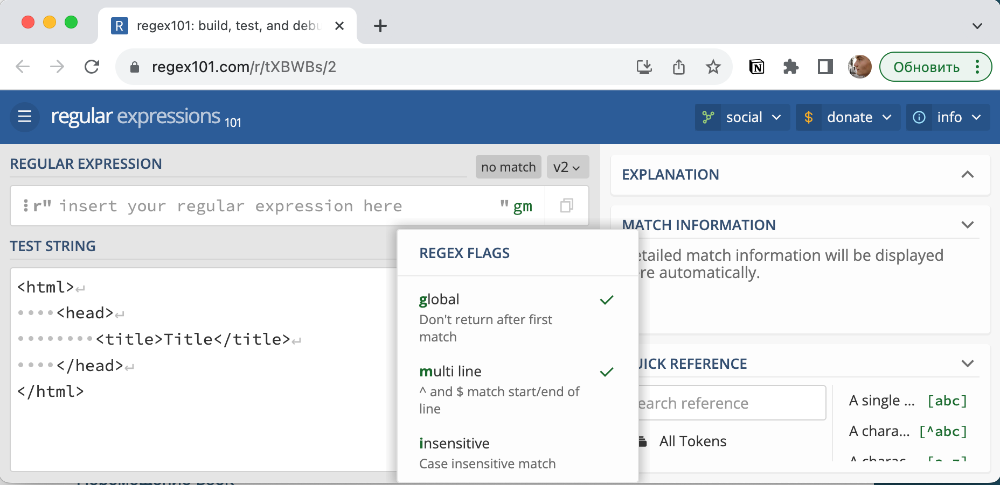
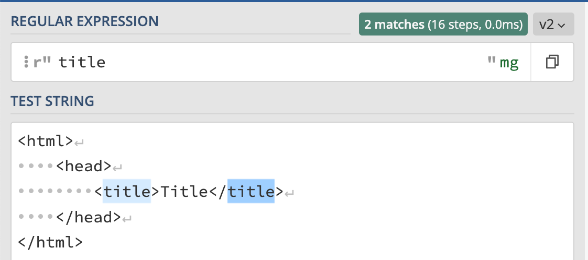
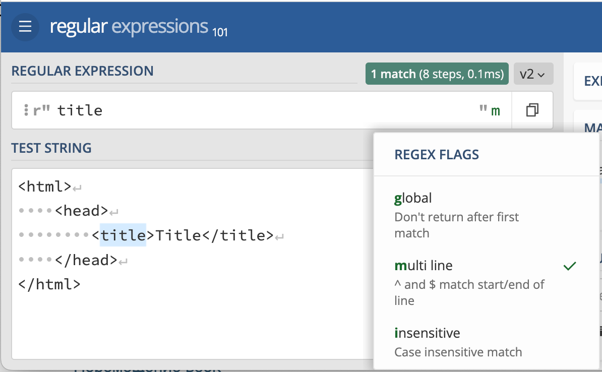
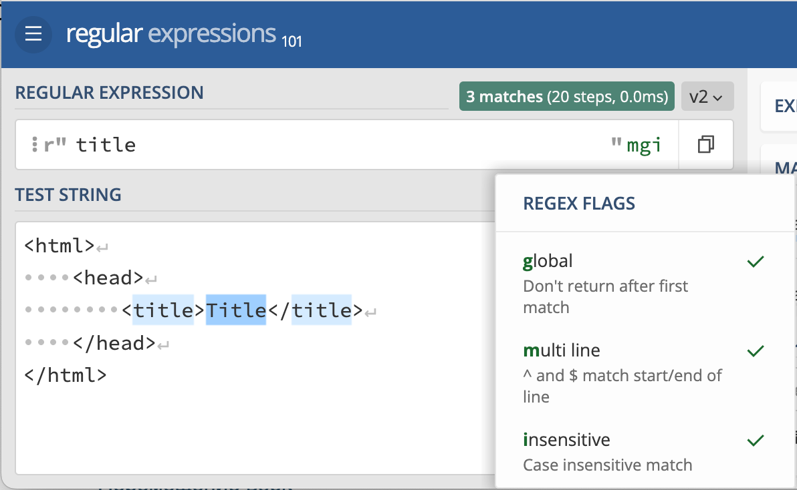
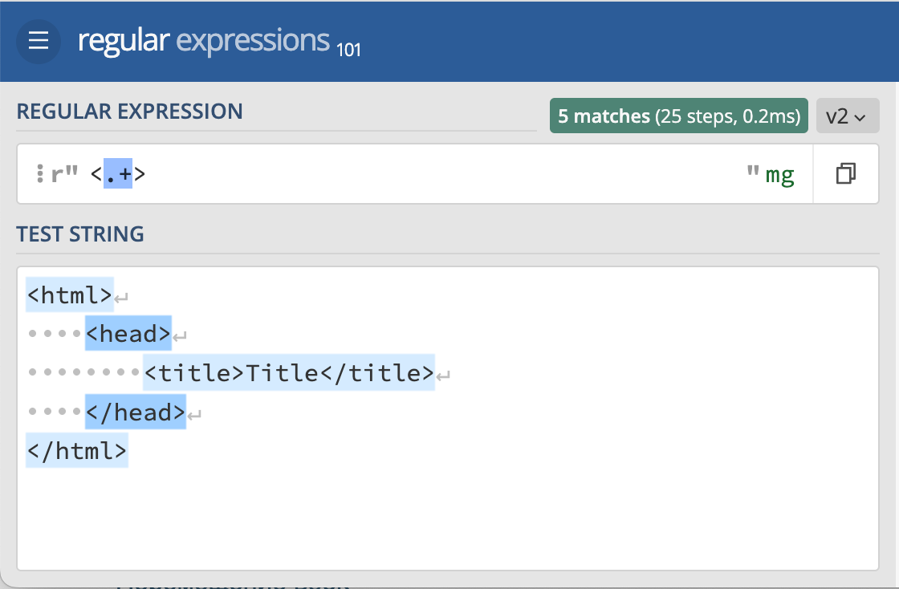
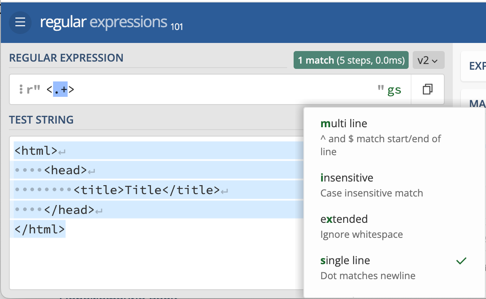
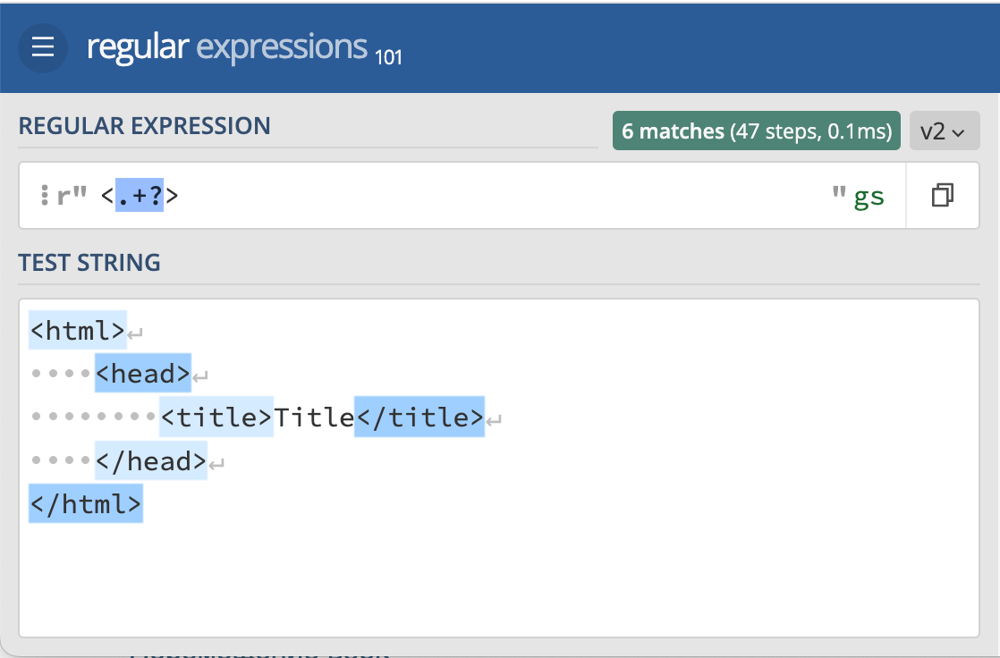

## Квантификаторы в регулярных выражениях

Квантификаторы представляют собой мощный инструмент в регулярных выражениях, позволяющий определить, сколько раз определенный элемент должен встречаться в тексте. Они играют важную роль в поиске и сопоставлении текстовой информации. Давайте подробнее разберем роль и типы квантификаторов.

### Роль квантификаторов

Квантификаторы определяют количество вхождений символа, символьного класса или группы символов в тексте. Они позволяют создавать более гибкие и мощные шаблоны для поиска и сопоставления.

### Основные квантификаторы

1. `?` (Вопросительный знак) - Этот квантификатор указывает, что предыдущий элемент может встречаться ноль или один раз.
2. `+` (Плюс) - Этот квантификатор указывает, что предыдущий элемент должен встречаться один или более раз.
    
    Например, вы хотите найти или валидировать URL-адреса в тексте. Для этого вы можете использовать регулярное выражение: **`https?://[\w.-]+`**. В этом регулярном выражении **`https?`** соответствует "http://" или "https://", **`://`** совпадает с двоеточием и двумя слэшами после "http://" или "https://", а **`[a-Z0-9.-]+`** соответствует доменному имени (например, "[www.example.com](http://www.example.com/)"). Квантификатор **`?`** после **`s`** позволяет сделать "s" необязательным.
    
3. `*` (Звездочка) - Этот квантификатор указывает, что предыдущий элемент может встречаться ноль или более раз. Например, выражение **`\w*\d*`**соответствует строкам, содержащим ноль или более букв (включая буквы, цифры и подчеркивания). Оно может совпадать с пустой строкой или строками, содержащими буквы и/или цифры, например, "word123", "42", или "" (пустая строка).
4. `{n}` - Этот квантификатор указывает точное количество вхождений предыдущего элемента. Например, `a{3}` будет соответствовать строке, содержащей ровно три буквы "a".
5. `{n,}` - Этот квантификатор указывает минимальное количество вхождений предыдущего элемента, равное "n" или более. Например, `a{2,}` найдет две или более буквы "a" подряд.
6. `{n,m}` - Этот квантификатор указывает диапазон количества вхождений предыдущего элемента, от "n" до "m". Например, `a{2,4}` найдет от двух до четырех букв "a" подряд.

### Практические примеры использования квантификаторов

Давай подробно разберем каждое из этих регулярных выражений:

1. `\b\d{3}\b` - Трехзначные числа:
    - `\b` - Это якорь слова, который обозначает начало или конец слова. Он гарантирует, что искомое трехзначное число находится в отдельном слове, а не внутри другого слова.
    - `\d` - Этот токен соответствует любой цифре от 0 до 9.
    - `{3}` - Этот квантификатор указывает, что предыдущий элемент (в данном случае, `\\d`) должен повторяться ровно три раза, то есть искомое число должно содержать три цифры подряд.
    - `\b` - Еще один якорь слова, обозначающий конец слова.
    
    Это регулярное выражение будет соответствовать всем трехзначным числам в тексте, которые находятся отдельно, например, "123", "456", "999", и так далее.
    
2. `\b\w+\b` - Все слова из текста:
    - `\b` - Опять же, это якорь слова, обозначающий начало или конец слова.
    - `\w+` - Этот токен соответствует одному или более буквенно-цифровым символам (буквам, цифрам или подчеркиванию). То есть, это выражение найдет одно или более слов в тексте.
    - `\b` - Закрывающий якорь слова.
    
    Это регулярное выражение будет соответствовать всем отдельным словам в тексте, где слова определяются как последовательности букв, цифр и/или подчеркиваний.
    
3. `\b\w+\d*\.log\b` - Все лог файлы с расширением filename.log, filename1.log, ...:
    - `\b` - Начало слова.
    - `\w+` - Слово, которое состоит из одной или более буквенно-цифровых символов (например, "filename").
    - `\d*` - Этот квантификатор указывает, что предыдущий элемент (цифра) может повторяться 0 или более раз. Это позволяет включить в соответствие файлы с числами в названии (например, "filename1", "filename2", и так далее).
    - `\.log` - Это просто соответствует строке ".log".
    - `\b` - Конец слова.
    
    Это регулярное выражение будет соответствовать строкам, представляющим лог-файлы с расширением ".log", включая файлы с числами в названиях, такие как "filename.log", "filename1.log", "logfile.log", и т. д.
    

## Ленивые и жадные квантификаторы в регулярных выражениях

В регулярных выражениях, квантификаторы могут быть либо жадными, либо ленивыми. Эти два типа квантификаторов влияют на то, как регулярное выражение будет соответствовать тексту. Давайте подробнее разберем понятия "жадных" и "ленивых" квантификаторов и их различия.

Пусть дан простейший HTML тег `div` - https://regex101.com/r/YyyPII/2

### Жадные квантификаторы

Жадные квантификаторы стремятся к нахождению максимально длинного совпадения в тексте. Они пытаются соответствовать как можно большему количеству символов. Например, рассмотрим следующее регулярное выражение:

```
<.+>

```

Если оно будет применено к тексту `<div>Это тег</div>`, то жадный квантификатор `+` попытается найти самое длинное совпадение, которое будет `<div>Это тег</div>`. Таким образом, жадные квантификаторы захватывают как можно больше текста.

### Ленивые квантификаторы

Ленивые квантификаторы, наоборот, стремятся к нахождению минимально длинного совпадения в тексте. Они предпочитают соответствовать как можно меньшему количеству символов. Тот же пример с регулярным выражением:

```
<.+?>

```

Чтобы сделать квантификатор ленивым, после него нужно поставить символ `?`. Если это ленивое регулярное выражение будет применено к тексту `<div>Это тег</div>`, то оно найдет минимальное совпадение, которое будет `<div>`. Ленивые квантификаторы захватывают как можно меньше текста.

### Выбор типа квантификатора

Выбор между жадными и ленивыми квантификаторами зависит от задачи. Если необходимо найти самое короткое совпадение (например, для разбора HTML-тегов по отдельности), ленивые квантификаторы более подходят. Если же нужно найти самое длинное совпадение, то используются жадные квантификаторы.

> Для реального разбора HTML страниц используйте специализированные библиотеки, например [beautiful soup](https://www.crummy.com/software/BeautifulSoup/bs4/doc.ru/).
> 

## Флаги (режимы) регулярных выражений

Флаги (режимы) в регулярных выражениях - это специальные параметры, которые позволяют настраивать поведение регулярных выражений при поиске текста. Каждый флаг выполняет определенную функцию и может быть полезен в разных сценариях обработки данных.

### Основные флаги:

1. insensitive **(или I)**: Этот флаг позволяет игнорировать регистр символов при поиске текста. То есть, регулярное выражение будет соответствовать символам независимо от их регистра.
2. multi line **(или M)**: Флаг мультилинии делает возможным сопоставление начала и конца строки внутри многострочного текста.
3. single line **(или S)**: Флаг single line позволяет символу точки (`.`) сопоставлять любой символ, включая символ новой строки. Это полезно, когда вы хотите переносить текст через несколько строк, используя только одно регулярное выражение.

Рассмотрим пример — https://regex101.com/r/tXBWBs/1. По умолчанию на сайте regex101 включены два флага `global`, который возвращает все возможные совпадения, а не останавливается только на первом.



Например, используйте в качестве регулярного выражения текст `title`. Если включен флаг `global`, то регулярное выражение найдёт два слова. 



Если, отключить этот флаг, то только первое слово. Проверьте, это. 



Верните обратно флаг `global` и установите флаг `insensitive`. Теперь будет найдено 3 слова. 



Отключите флаг `insensitive`. 

Теперь проверим регулярное выражение `<.+>`, результат будет следующим



Но почему, если использовался жадный квантификатор, каждая строка была захвачена по отдельности, а не весь текст, от первого до последнего символа? Причины две. Первая причина флаг `multi line`, из-за него regex101 воспринимает каждую строку как отдельный текст, а не как единое целое. Отключите этот флаг. Но результат не поменятся. Связано это с тем, что в символ `.` (любой символ) по умолчанию попадает всё, кроме символа переноса строки. Чтобы учесть этот момент, нужно включить флаг `single line`. И тогда результатом поиска регулярным выражением будет весь текст. 



Ну и напоследок сделайте квантификатор ленивым. Таким образом можно найти все шесть html тегов.  


